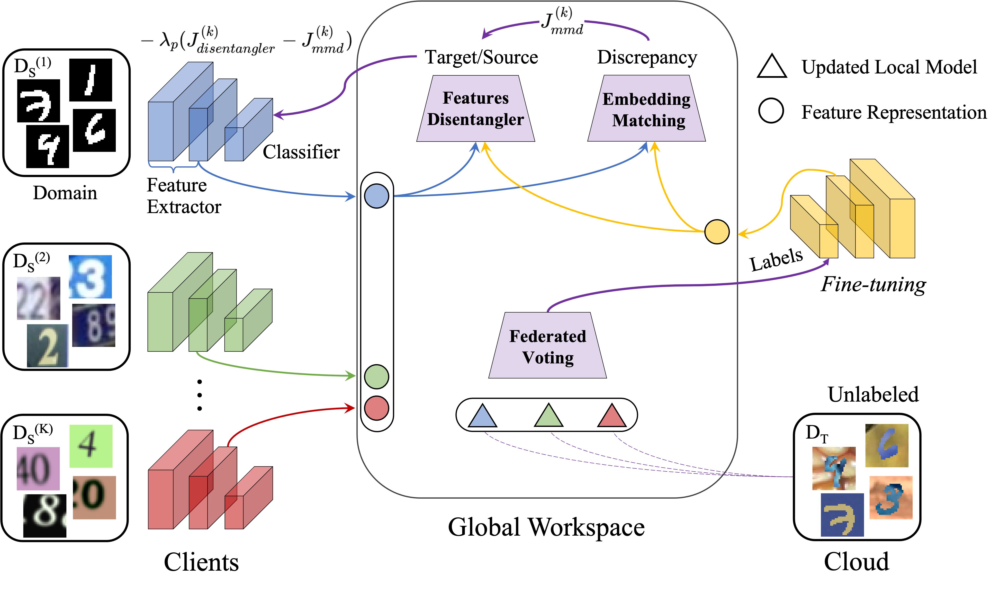

## This is a PyTorch implementation of the paper [Multi-Source Domain Adaptation Based on Federated Knowledge Alignment](https://arxiv.org/abs/2203.11635).

## Table of Contents
* [General information](#general-information)
* [Running the systems](#running-the-systems)
* [Further readings](#further-readings)

## General information
FedKA that consists of three building blocks, i.e., features disentangler, embedding matching, and federated voting, aims to improve the global model’s generality in tackling an unseen task with knowledge transferred from different clients’ model learning.

## Running the systems
The systems can be run with the Jupyter Notebook "FedKA.ipynb".

## Further readings
* [Decentralized Deep Learning for Multi-Access Edge Computing: A Survey on Communication Efficiency and Trustworthiness](https://www.techrxiv.org/articles/preprint/Decentralized_Deep_Learning_for_Multi-Access_Edge_Computing_A_Survey_on_Communication_Efficiency_and_Trustworthiness/16691230), Yuwei Sun et al., IEEE Transactions on Artificial Intelligence.  

